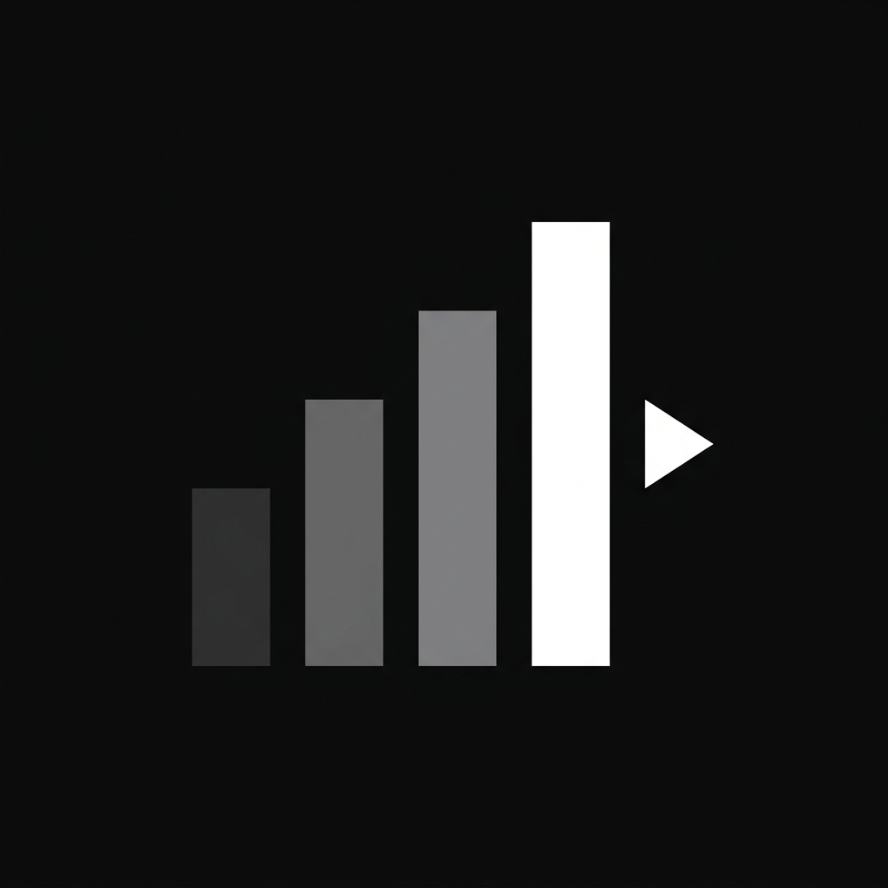

# VidMetrics: Command Console
### High-Octane YouTube Channel Analytics for Modern Creators

VidMetrics is a tactical analytics dashboard designed to surface the true signal in the noise of YouTube data. Built with a Monochrome Brutalist aesthetic, it skips the vanity metrics and focuses on what actually drives growth: creative reliability, engagement velocity, and algorithmic momentum.



---

## Core Intelligence: The Command Console

The dashboard is built around a high-density Command Console that provides instant situational awareness.

*   **Activity Intelligence**: A dynamic tempo engine that analyzes upload cadence and recency to classify channels as ACTIVE, INACTIVE, or HYPERACTIVE, providing tactical advice on algorithmic decay.
*   **Viral Hit Rate**: Measures creative reliability by calculating the percentage of videos that exceed the channel's 1.5x median view baseline.
*   **Engagement Velocity**: High-leverage tracking of Engagement per 100 Views (Efficiency of Impression), surfacing which topics are actually hitting the right audience.
*   **Tactile Tooltips**: Deep-dive data breakdowns (Likes vs. Comments) available on every video card via hover tooltips.

---

## Security and Quota Hardening

Designed to be public-ready, VidMetrics features a multi-layer defense system to protect the YouTube API quota:

1.  **IP-Based Rate Limiting**: Capped at 15 searches per day per user.
2.  **Global Killswitch**: A master lock that caps the entire app at 850 searches per day to prevent API key suspension during viral spikes.
3.  **Honeypot Trap**: A stealthy bait input that detects and instantly rejects automated bot scrapers.

---

## Tech Stack

- **Framework**: Next.js 16+ (App Router)
- **Styling**: Tailwind CSS
- **Charts**: Recharts
- **Animations**: Framer Motion
- **Security**: @upstash/ratelimit + Redis
- **Data**: YouTube Data API v3

---

## Quick Start

### 1. Prerequisites
You will need a YouTube Data API Key and an Upstash Redis database.

### 2. Environment Setup
Create a .env.local file in the root directory:

```env
YOUTUBE_API_KEY=your_google_api_key
UPSTASH_REDIS_REST_URL=your_upstash_url
UPSTASH_REDIS_REST_TOKEN=your_upstash_token
```

### 3. Run Locally
```bash
npm install
npm run dev
```

---


**Developed with focus on data clarity in 2026.**
